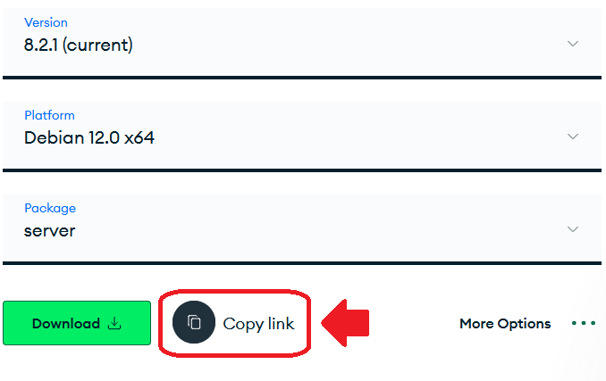

# Preámbulo

MongoDB es la mejor opción (o de las mejores) para bases de datos No-SQL. Es una opción muy versátil para los que prefieren que en los modelos de datos predominen los datos brutos y no IDs, lo que (a veces) puede hacer que la curva de aprendizaje y rapidez con la que se construye una arquitectura de software sea mejor. 

MongoDB tiene una plataforma que ofrece base de datos como servicio (MongoDB Atlas), sin embargo, no es difícil instalar y mantener una base de datos para aplicaciones de baja o media cantidad de usuarios. Por ello, esta implementación explicada en este post es válida y recomendable.

# Buscar la versión justa

En [la siguiente URL](https://www.mongodb.com/try/download/community) se presenta un formulario que ayudará al administrador a descargar el binario apropiado para la distribución de Linux que se está usando. En el caso del tutorial se utiliza Debian 13.1.

Se deben seleccionar las siguientes opciones, válidas en la fecha que se escribió el tutorial:

- Version: 8.2.1 (current)
- Platform: Debian 12.0 x64 (es compatible con la versión 13)
- Package: server

Justo debajo de la opción **Package** se hace clic en "Copy link".



# Instalar MongoDB Community

Este link que se copió es el archivo ".deb", que puede instalarse en Debian.

1. Descargar archivo

```bash
wget https://repo.mongodb.org/apt/debian/dists/bookworm/mongodb-org/8.2/main/binary-amd64/mongodb-org-server_8.2.1_amd64.deb
```

2. Instalar archivo

```bash
dpkg -i mongodb-org-server_8.2.1_amd64.deb
```

Ahora estará presente el nuevo archivo **/usr/bin/mongod**.

# Crear carpetas para mongod

Antes de iniciar la base de datos, es necesario crear la carpeta dónde va a trabajar el daemon:

```bash
mkdir -p /data/db
```

Ahora *mongod* puede ser ejecutado, sin embargo, es mejor aprovechar el servicio que se instaló en *systemd*. De esta forma, el daemon de MongoDB siempre iniciará como un programa en segundo plano, y mientras el servidor que ejecuta este programa esté encendido, será posible hostear bases de datos en este equipo.

Se habilita el servicio systemd:

```bash
systemctl enable mongod
```

Y se inicia:

```bash
systemctl start mongod
```

Se ejecuta el comando `systemctl status mongod`, para poder verificar que esté "active (running)". Una vez con todo esto correcto, se puede utilizar la base de datos Mongo en el host y puerto **localhost:27017** 😉

# Instalar herramientas de la base de datos

MongoSH (MongoDB Shell) es una aplicación que permite interactuar por terminal con cualquier base de datos manejada por MongoDB. Se puede seleccionar una versión desde la web oficial con un formulario similar al de [Instalar MongoDB Community](#instalar-mongodb-community).

A continuación se ofrece un comando para descargar una versión compatible con el MongoDB propuesto.

```bash
wget https://downloads.mongodb.com/compass/mongodb-mongosh_2.5.9_amd64.deb
```

Y se instala con el *dpkg*:

```bash
dpkg -i mongodb-mongosh_2.5.9_amd64.deb
```

# Ejecutar mongosh

Simplemente escribiendo `mongosh` en la terminal y apretando ENTER, se lanza la Shell de MongoDB con el siguiente mensaje:

```
Current Mongosh Log ID: 691a753c88ae3b24b69dc29c
Connecting to:          mongodb://127.0.0.1:27017/?directConnection=true&serverSelectionTimeoutMS=2000&appName=mongosh+2.5.9
Using MongoDB:          8.2.1
Using Mongosh:          2.5.9
```

# Restringir el acceso a MongoDB

Al iniciar `mongosh`, aparece el siguiente warning:

```
Access control is not enabled for the database. Read and write access to data and configuration is unrestricted
```

Esto notifica que cualquier cliente puede conectarse y leer/escribir sin ningún tipo de credenciales. En ambientes de producción, esto no puede ser posible y debe solucionarse creando un usuario administrador llamado "sistemas", que está protegido mediante una contraseña:

1. Se ingresa a la base de datos "admin" con la palabra clave *use*:

```
use admin
```

2. Se crea el usuario "sistemas":

```
db.createUser({
  user: "sistemas",
  pwd: "<una_contraseña_segura>",
  roles: [ { role: "userAdminAnyDatabase", db: "admin" } ]
})
```

El resultado será

```
{ ok: 1 }
```

Ahora, debe configurarse un archivo de configuración:

```
nano /etc/mongod.conf
```

Se verá la siguiente línea:

```
#security:
```

Que debe dejarse tal cuál se lee a continuación:

```
security:
  authorization: enabled
```

Para terminar, se reinicia *mongod*:

```
systemctl restart mongod
```

# Iniciar sesión en MongoDB

Como se explica en el capítulo de [Restringir el acceso a MongoDB](#restringir-el-acceso-a-mongodb), el usuario "sistemas" se creó como administrador, se editó el archivo de configuración y reinició el servicio. A partir de ahora, *mongod* permitirá sólo a usuarios autorizados: "sistemas" es uno.

Para iniciar sesión a MongoDB desde ahora:

```bash
mongosh -u sistemas -p <tu_contraseña_segura> --authenticationDatabase admin
```

# Iniciar sesión en MongoDB desde un servicio back-end

Si la base de datos MongoDB está montada en el mismo servidor que tu aplicación back-end y el puerto es el default (27017), la conexión cambia su URL a:

```
mongodb://sistemas:<tu_contraseña_segura>@localhost:27017/nombreDeLaBaseDeDatos?authSource=admin
```

Note que `authSource=admin` se refiere a que la base de datos "admin" será la que autenticará la conexión. En el capítulo [Restringir el acceso a MongoDB](#restringir-el-acceso-a-mongodb), se creó el usuario "sistemas" en la base de datos "admin".

# Salir de mongosh

En la shell de MongoDB puede escribirse el comando `quit` para cerrar el proceso y volver a la terminal de Linux.

# Epílogo

