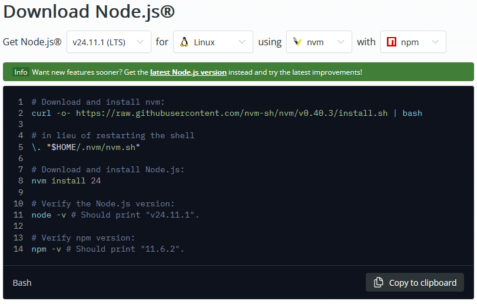

# Preámbulo

En servidores VPS que no cuentan con tantos recursos para un Docker, sigue siendo relevante y válido utilizar NodeJs. Hace ya varios años, además, que la herramienta NVM facilita el manejo de versiones de Node. Este tutorial indica como tener todo listo en segundos.

# La web oficial

Se debe ir a [la web oficial](https://nodejs.org/en/download) y realizar esta serie de selecciones en el formulario.



Los comandos que muestra la web deben ser ejecutados uno a uno:

1. Se descarga el script de instalación:

```bash
curl -o- https://raw.githubusercontent.com/nvm-sh/nvm/v0.40.3/install.sh | bash
```

2. Se instala NVM:

```bash
\. "$HOME/.nvm/nvm.sh"
```

3. Se instala la versión 24 de NodeJs, mediante NVM:

```bash
nvm install 24
```

4. Ahora se corrobora la versión de Node y NPM que se instaló en el dispositivo:

```bash
node -v && npm -v
```

En el caso del tutorial, marcó estas versiones:

- Node: v24.11.1
- NPM: 11.6.2

# Instalación de PM2

## ¿Qué es PM2?

**PM2** es un daemon que permite:
- Monitorear los recursos que consume una aplicación escrita en JS
- Iniciar, detener y reiniciar una aplicación Javascript (back-end)
- Guardar un servicio para que arranque junto a Linux

Esta aplicación se instala desde NPM:

```bash
npm install pm2 -g
```

## Hacer que corra como proceso de systemd

```bash
pm2 startup systemd
```

Output:

```bash
pm2 startup systemd

                        -------------

__/\\\\\\\\\\\\\____/\\\\____________/\\\\____/\\\\\\\\\_____
 _\/\\\/////////\\\_\/\\\\\\________/\\\\\\__/\\\///////\\\___
  _\/\\\_______\/\\\_\/\\\//\\\____/\\\//\\\_\///______\//\\\__
   _\/\\\\\\\\\\\\\/__\/\\\\///\\\/\\\/_\/\\\___________/\\\/___
    _\/\\\/////////____\/\\\__\///\\\/___\/\\\________/\\\//_____
     _\/\\\_____________\/\\\____\///_____\/\\\_____/\\\//________
      _\/\\\_____________\/\\\_____________\/\\\___/\\\/___________
       _\/\\\_____________\/\\\_____________\/\\\__/\\\\\\\\\\\\\\\_
        _\///______________\///______________\///__\///////////////__


                          Runtime Edition

        PM2 is a Production Process Manager for Node.js applications
                     with a built-in Load Balancer.

                Start and Daemonize any application:
                $ pm2 start app.js

                Load Balance 4 instances of api.js:
                $ pm2 start api.js -i 4

                Monitor in production:
                $ pm2 monitor

                Make pm2 auto-boot at server restart:
                $ pm2 startup

                To go further checkout:
                http://pm2.io/


                        -------------

[PM2] Init System found: systemd
Platform systemd
Template
[Unit]
Description=PM2 process manager
Documentation=https://pm2.keymetrics.io/
After=network.target

[Service]
Type=forking
User=root
LimitNOFILE=infinity
LimitNPROC=infinity
LimitCORE=infinity
Environment=PATH=/root/.nvm/versions/node/v24.11.1/bin:/usr/local/sbin:/usr/local/bin:/usr/sbin:/usr/bin:/sbin:/bin:/bin:/usr/local/sbin:/usr/local/bin:/usr/sbin:/usr/bin
Environment=PM2_HOME=/root/.pm2
PIDFile=/root/.pm2/pm2.pid
Restart=on-failure

ExecStart=/root/.nvm/versions/node/v24.11.1/lib/node_modules/pm2/bin/pm2 resurrect
ExecReload=/root/.nvm/versions/node/v24.11.1/lib/node_modules/pm2/bin/pm2 reload all
ExecStop=/root/.nvm/versions/node/v24.11.1/lib/node_modules/pm2/bin/pm2 kill

[Install]
WantedBy=multi-user.target

Target path
/etc/systemd/system/pm2-root.service
Command list
[ 'systemctl enable pm2-root' ]
[PM2] Writing init configuration in /etc/systemd/system/pm2-root.service
[PM2] Making script booting at startup...
[PM2] [-] Executing: systemctl enable pm2-root...
Created symlink '/etc/systemd/system/multi-user.target.wants/pm2-root.service' → '/etc/systemd/system/pm2-root.service'.
[PM2] [v] Command successfully executed.
+---------------------------------------+
[PM2] Freeze a process list on reboot via:
$ pm2 save

[PM2] Remove init script via:
$ pm2 unstartup systemd
```

## Habilitar servicio

```
systemd enable pm2-root
```

## Iniciar servicio

```
systemd start pm2-root
```

## Iniciar una aplicación con pm2

Suponiendo que el punto de inicio de una aplicación back-end escrita en NodeJs está en **/opt/gabs/src/index.js** y se quiere identificar dentro de PM2 con el nombre "back", se puede ejecutar:

```bash
pm2 start gabs/src/index.js --name back
```

## Guardar el estado

Texto.

Nota importante sobre el working directory: Texto.

# Epílogo

Texto.